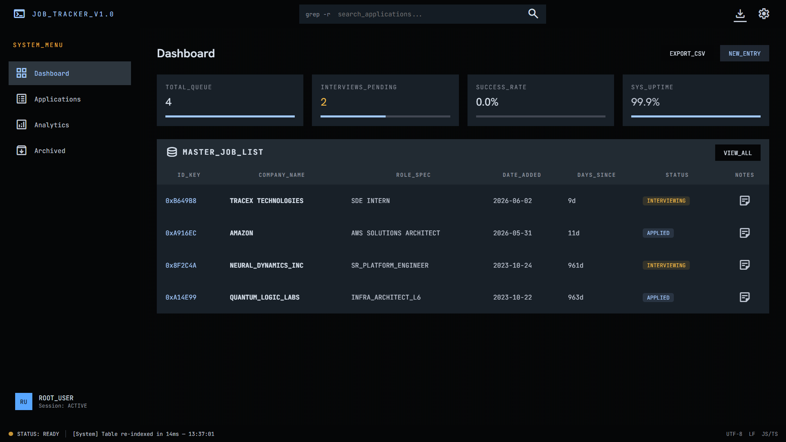
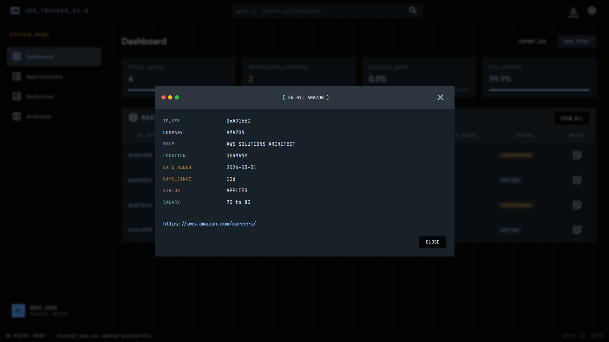
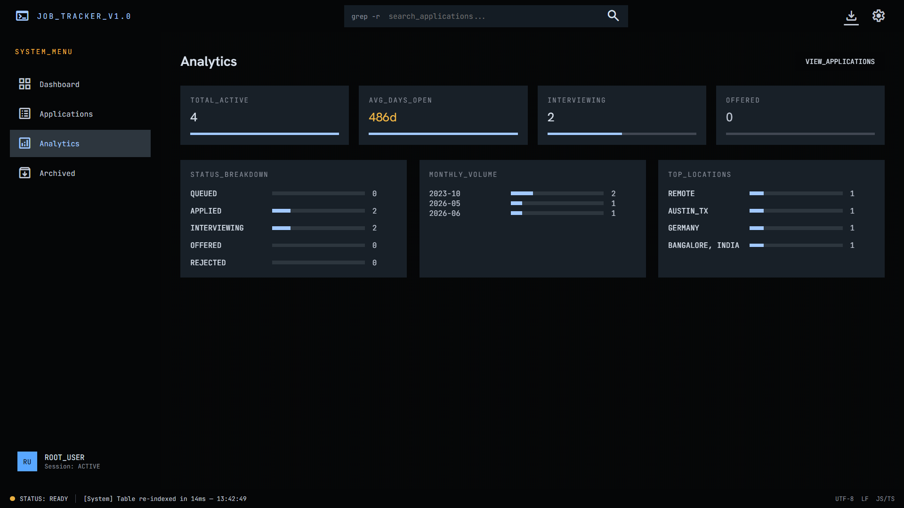
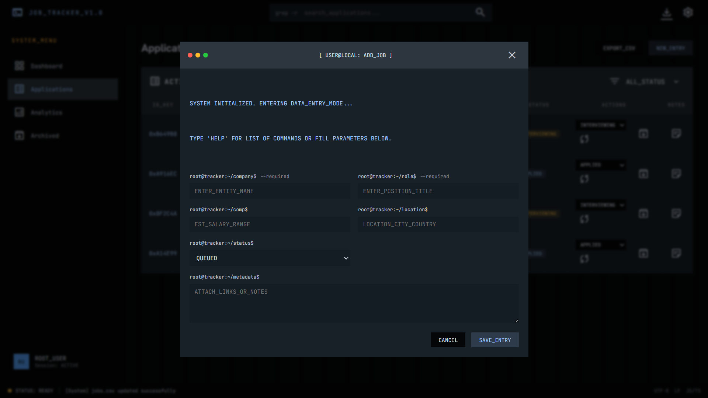

>[!tip]
>Best experience when created as a .exe file

Current Look:

## Main Page

## Job Card

## Analytics - (Need to be improved)

## New entry

How to use it? 
1. Install the dependencies
2. Use `python desktop.py` for using it as live desktop app for debugging purposes
3. Compile into an application using PyInstaller

